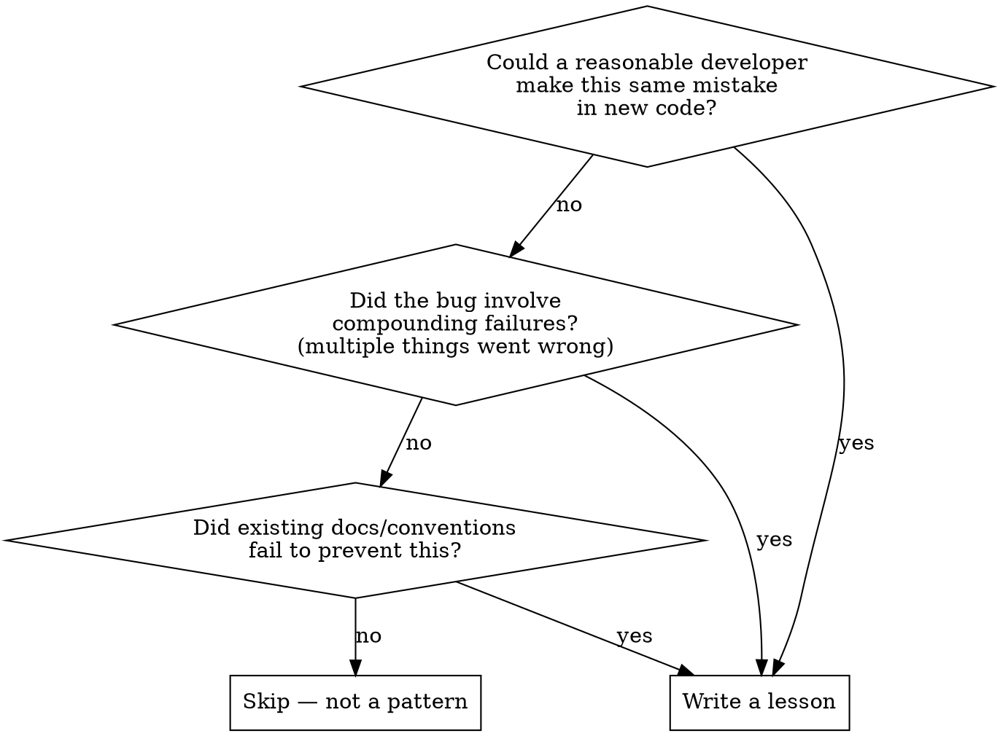

# /pomo — Post-Mortem

Reflect on a recently resolved issue, decide whether it reveals a pattern worth encoding, and if so, write it into the project's lesson system.

## Invocation

```
/pomo              # Reflect on what just happened in this session
/pomo <context>    # Reflect on a specific issue (e.g., a PR URL, issue number)
```

## Process

### Step 1: Reconstruct the incident

Review the conversation (or provided context) and identify:

1. **Symptom** — What the user observed (e.g., "token verification fails")
2. **Root cause** — The actual underlying defect (e.g., "DB not re-initialized after reset")
3. **Cause chain** — How the root cause produced the symptom, including any compounding failures (e.g., silent error swallowing, port reuse masking the broken server)
4. **Fix** — What was changed and why

Write a brief summary (3-5 sentences) of the incident for the user to confirm before proceeding.

### Step 2: Evaluate whether this warrants a lesson

Not every fix needs a post-mortem. Apply this decision tree:



**Skip when:**
- Simple typo, syntax error, or copy-paste mistake
- One-off configuration/environment issue
- The fix was obvious from the error message
- An existing lesson already covers this exact pattern

If skipping, tell the user why and stop here.

### Step 3: Check for duplicates

Read `.claude/lessons.md` and check whether an existing lesson already covers this pattern. If so:
- **Same pattern, new example:** Update the existing lesson with an additional incident reference. Don't create a duplicate.
- **Related but distinct:** Create a new lesson and cross-reference the related one.

### Step 3b: Lifecycle management

If `.claude/lessons.md` exceeds 40 entries, run a pruning pass before adding new content:

1. **Scan for promoted lessons:** Check each entry against CLAUDE.md instructions and command rules. If a lesson has been encoded as a permanent rule, flag it for removal with a note: "Promoted to CLAUDE.md § [section]" or "Promoted to [command]"
2. **Scan for stale lessons:** Identify entries with no matching incidents in the current project context. Flag as candidates for archival.
3. **Move flagged entries** to `.claude/lessons-archive.md` (create if needed). Archive entries remain searchable but don't load at session start.
4. **Report:** "Pruned N lessons (M promoted, K stale). Active: NN/40."

See `agent_docs/self-improvement.md` § Lesson lifecycle for the full lifecycle states (Active → Validated → Promoted → Stale).

### Step 4: Write the lesson

Add a new entry to `.claude/lessons.md` following the format defined in `agent_docs/self-improvement.md`. If `.claude/lessons.md` doesn't exist yet, create it.

**Lifecycle awareness:**
- New lessons are implicitly **Active**
- If Step 3 found a matching existing lesson, update it and mark as **Validated** (2+ incidents)
- If a lesson has been validated 3+ times, propose **promotion** to a CLAUDE.md instruction or command rule (handled in Step 5)

Guidelines:
- The rule should be **generalizable** — not "don't forget to call initialize() after reset()" but "destructive operations must reconstruct usable state"
- Include a code example only if it makes the rule significantly clearer
- Keep each lesson concise

### Step 5: Consider CLAUDE.md update

If the lesson reveals a high-confidence, broadly applicable anti-pattern that should guide all future development on this project, propose adding it to CLAUDE.md. Ask the user before modifying CLAUDE.md — not every lesson belongs there.

### Step 6: Summarize

Tell the user:
- What lesson was captured (or why none was needed)
- Which files were updated
- Whether CLAUDE.md was modified (since that affects all future sessions)
